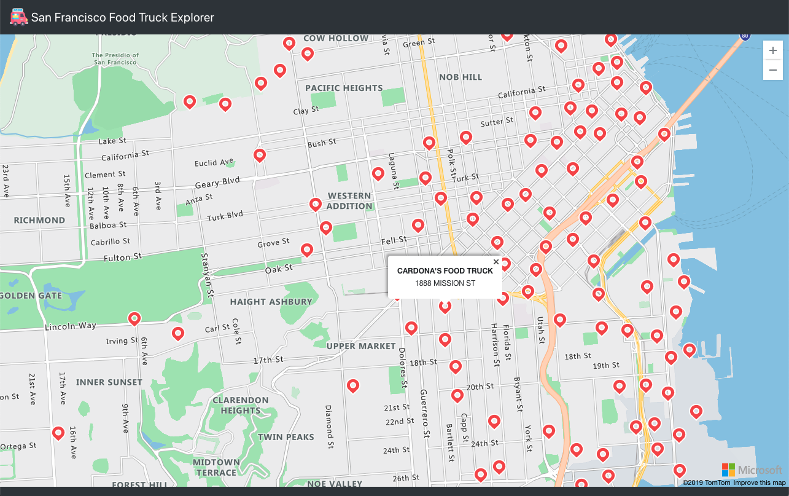

# San Francisco Food Truck Explorer

A prototype application written in TypeScript and React.js to easily visualize in Microsoft Azure Maps all the current active food trucks in the city of San Francisco, CA.



A live version of this application can be demoed [here](http://joaquinrdz.com).

## Technologies Used

-   React.js / create-react-app
-   TypeScript
-   React Bootstrap
-   [React-Azure-Maps](https://www.npmjs.com/package/react-azure-maps)
-   NGINX
-   Docker
-   SoQL for San Francisco Data API

## One-line command to test the application locally without installing any requirements other than Docker

```shell
docker run -p 8080:80 joaquinrodriguez/sf-foodtrucks:latest
```

The application will be ready to be seen at http://localhost:8080

## Getting Started

The following instructions will get you up and running in your local environment.

### Prerequisites

-   NPM 6.14+
-   Node 12.16+
-   Azure Maps [Subscription Key](https://docs.microsoft.com/en-us/azure/azure-maps/azure-maps-authentication)

### Installing

Clone the repository

```shell
git clone https://github.com/joaquinrdz89/sf-foodtrucks.git && cd sf-foodtrucks
```

Install the necessary dependencies

```shell
npm install
```

Create an .env file to store Azure Maps API Key

```shell
echo "REACT_APP_AZURE_MAP_API_KEY=<YOUR_KEY_GOES_HERE>" >> .env
```

Run the application in development mode

```shell
npm start
```

The application will be ready to be seen at http://localhost:3000

## Creating a Production Build

The following command will create an optimized production build in the `./build` folder

```shell
npm run build
```

## Creating a Production Image using Docker

```shell
docker build --build-arg REACT_APP_AZURE_MAP_API_KEY=<YOUR_KEY_GOES_HERE> . -t <repo_name>/<image_name>
```

## Future Enhancements

-   Add Search Functionality
-   Integrate with Yelp API to provide more information about the food truck (telephone, hours, etc)
-   Filter results
-   Have a local datastore (e.g. MongoDB, Elasticsearch) to store the food trucks without having to rely on the SF API and to improve performance

## Other Notes

Coming from a backend development background, this application was an innovative way to come up to speed with some of the features that React.js has to offer.

## Authors

-   **Joaquin Rodriguez** - _Initial work_ - [joaquinrdz89](https://github.com/joaquinrdz89)

## Attributions

-   Icon made by Freepik from www.flaticon.com
